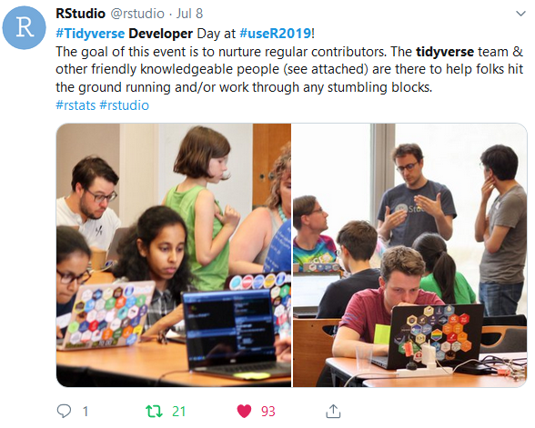
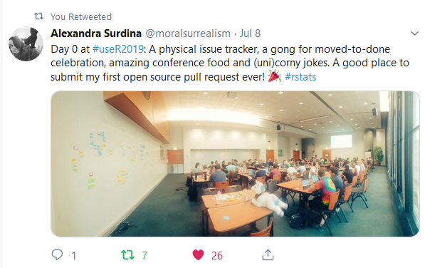
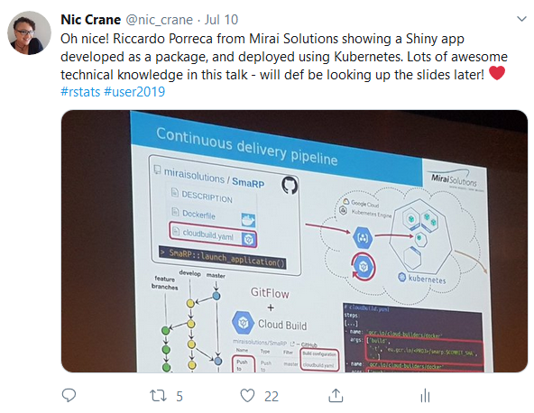
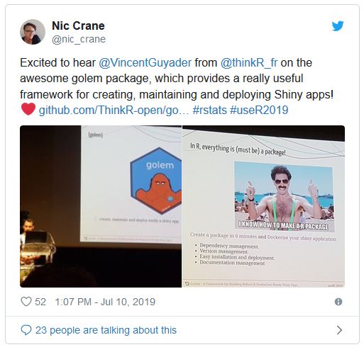
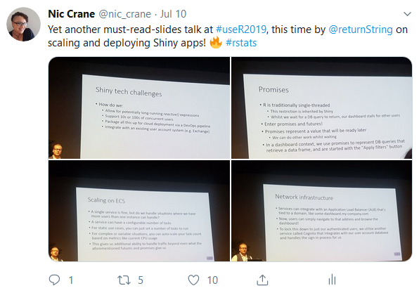
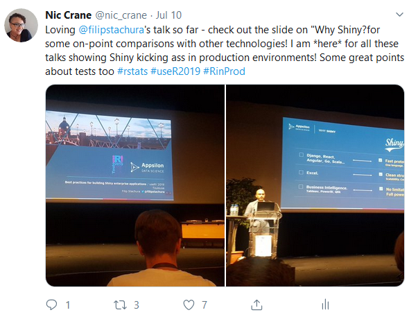
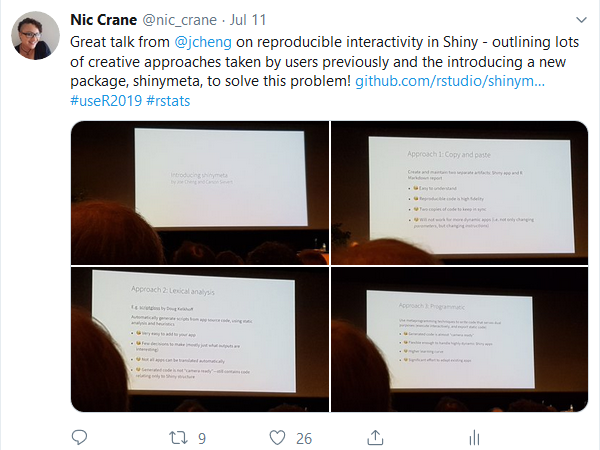
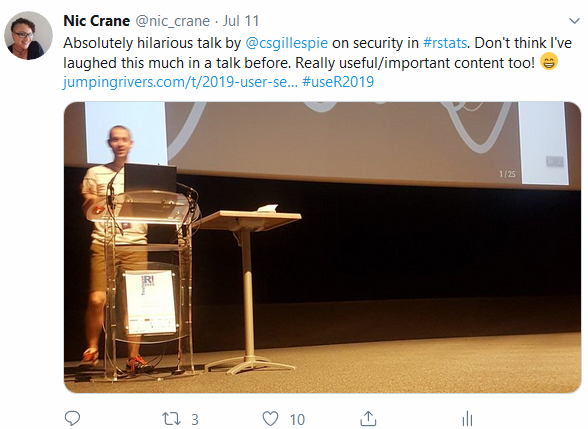
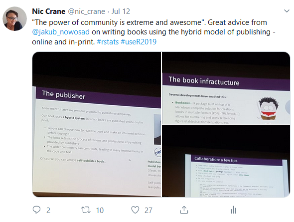
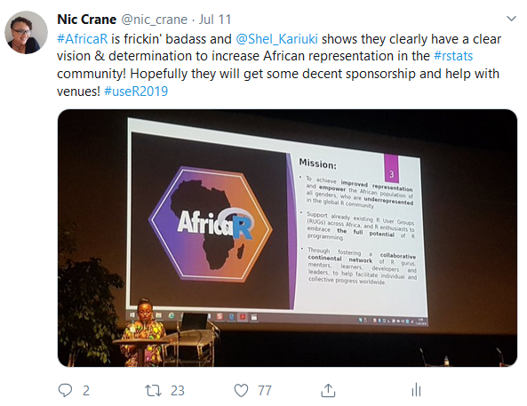

# UseR!2019

UseR!2019 was a fantastic conference.  I've previously attended RStudio Conference and EARL, both of which are very different conferences.  I've enjoyed all three, and especially like how they each bring something different to the R conference playing field.

I mainly work in Shiny, and so most of this post will be including some of my Shiny-focussed highlights, with a few other special mentions.

The conference kicked off with a Tidyverse Developer Day, organised by RStudio.  Whilst I was not able to attend this one, I have previously attended one in January immediately following RStudio Conference 2019.

```{r,  out.width = "40%", fig.align= "center", echo = FALSE}
 
```

I absolutely love the idea; it allows new and not-so-new contributors to get together, and work and code and documentation issues in the tidyverse.  

Whilst I didn't attend, I heard lots of great feedback from attendees, and it was clear that RStudio had listened to feedback from us from last time (e.g. running the dev day before the conference, so that everybody wouldn't be socially exhausted by that point!)

```{r,  out.width = "40%", fig.align= "center", echo = FALSE}
 
```

## Workshops

I'd attended the conference on a scholarship, and so got to attend the workshops as well.

Package Development was taught by Jenny Bryan, Jim Hester, and Hadley Wickham, and it was the workshop I attended in the morning.  I'd originally gone along to observe their teaching styles and pick up tips, but learned a surprising number of new things.

The main things I liked were:

* instructors completing the exercises on-screen as the attendees were; this meant that whether you were completely new and may want to follow along, or more experienced and wanted to ignore this and complete the exercises yourself, this section would work well for you.

* explanations of their own setups and why they've done it like that

* inclusion of more complex materials that more proficient learner can dig into deeper afterwards

* highlighting the key principles that tie the materials together

* highlighting problems you may face and explaining how to solve them

* concluding a section with "if you only remember one thing..." and then launching into a summary

## Talks

There were a huge range of talks, and the one big different between the other R conferences I'd been to was that here there were a mix of academic and industry talks.  I mainly do work in Shiny, so I mainly went to Shiny-themed talks; here are my highlights, in no particular order.

### Shiny or Go Home

There were lots of fantastic details on Shiny app deployment by Riccardo Porreca from Mirai Solutions in their talk, ["Shiny app deployment and integration into a custom website gallery"](https://user2019.r-project.org/static/pres/t258350.pdf).

```{r,  out.width = "40%", fig.align= "center", echo = FALSE}
 
```

It was also great to hear Vincent Guyader from ThinkR talking about the golem package in their talk ["Golem - A Framework for Building Robust & Production Ready Shiny Apps"](https://github.com/VincentGuyader/user2019/raw/master/golem_Vincent_Guyader_USER!2019.pdf).  There's not a huge amount of guidance out there around structuring Shiny apps,and so this package and everything discussed in the talk will provide a lot of value for Shiny devs.

```{r,  out.width = "40%", fig.align= "center", echo = FALSE}
 
```

Ruan Pearce-Authers did an excellent job in ["Data for all: Empowering teams with scalable Shiny applications"](https://www.slideshare.net/RuanPearceAuthers/data-for-all-empowering-teams-with-scalable-shiny-applications-user-2019) of showing us how they deploy Shiny apps at scale.

```{r,  out.width = "40%", fig.align= "center", echo = FALSE}
 
```

Filip Stachura from Appsilon gave some real insight into the things they find the most important when deploying Shiny in production environments in ["Best Practices for Building Shiny Enterprise Applications "](https://www.slideshare.net/appsilon/user-2019-best-practices-for-building-shiny-enterprise-applications), though my favourite part was the direct comparisons with other similar technologies.

```{r,  out.width = "40%", fig.align= "center", echo = FALSE}
 
```

Joe Cheng's keynote on the new [`shinymeta`](https://github.com/rstudio/shinymeta) package, ["Shiny's Holy Grail: Interactivity with reproducibility"](https://github.com/jcheng5/shinymeta-user2019-talk) was fascinating, and it whilst the package is in its early stages (it's not yet on CRAN), it looks to be adding a really useful feature to Shiny.  Watch the full keynote [here](https://www.youtube.com/watch?v=5KByRC6eqC8).

```{r,  out.width = "40%", fig.align= "center", echo = FALSE}
 
```

### Not Shiny but Still Shone

I loved Colin Gillespie's talk on security in Shiny: ["Security and R
It's secure - we’re the problem"](https://www.jumpingrivers.com/t/2019-user-security/#1) - it was a lot of fun but also highlighted some important points around a less well-discussed topic; security in R.

```{r,  out.width = "40%", fig.align= "center", echo = FALSE}
 
```

I also found the talk by Jakub Nowosad, ["How to win friends and write an open-source book"](https://geocompr.github.io/user_19/presentation/#1) to be packed full of useful information on publishing R books, that I've already put to use whilst looking for a publisher for a book I'm making a start on soon.

```{r,  out.width = "40%", fig.align= "center", echo = FALSE}
 
```

Finally, it was awesome to meet Shel Kariuki and hear about all the great work that the AfricaR team are doing to try to set up a community for R users in Africa.

```{r,  out.width = "40%", fig.align= "center", echo = FALSE}
 
```

## Conclusion

There were lots of other fantastic talks, and these are just a small selection of some of the ones I enjoyed.  UseR!2019 was a really enjoyable conference and I hope to attend again next time.  Till then, I can't wait for [eRum 2020 in Milan](http://2020.erum.io/)!