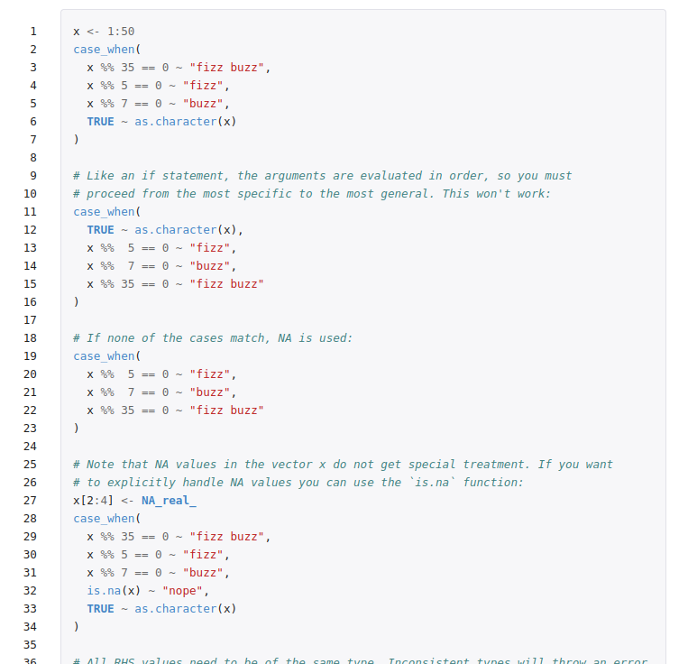

As part of my ongoing mission to make the documentation of the arrow R package as good as it can be, I've started thinking about what are the qualities of good examples.  In my experience, having example code that I can run is the best way for me to achieve rapid familiarity with an R function I haven't worked with before, or understand how to make best use of a function about which I already understand the basics.  In the book "R Packages", Hadley Wickham [remarks](https://r-pkgs.org/man.html#man-functions) that examples are "a very important part of the documentation because many people look at the examples first" and [rOpenSci recommend](https://devguide.ropensci.org/building.html#general) that each of a package's exported functions should be accompanied by examples.

In this blog post, I'm going to explore the things that I believe make for good function examples in documentation, focussing on R but also mentioning some examples from Python.

## What good looks like in R

I asked people on Twitter for their opinions of good R package documentation, and [Jonathan Sinclair](https://twitter.com/_J_sinclair/status/1391677551261650945) highlighted the 'examples' section from [`dplyr::case_when`](https://rdrr.io/cran/dplyr/man/case_when.html), the beggining of which is shown below.

I think Jonathan is spot on in his assessment.  To paraphrase, the highlights for him are:

* there is next to no prose or intro
* there are plenty of comments where needed
* it includes a variety of examples
* it includes examples of what *not* to do.

This kind of documentation really appeals to my skim-reading self.  If I'm trying to accomplish a task, sometimes I just want to run some code and see what happens, to get an intuitive feel for what a function does.  Whilst I am fully prepared to slow down and read the rest of the documentation, a "quick win" motivates me to invest the additional effort.  It tells me that the developers of this code have prioritised making things easy to understand, and that the time I am investing will pay off.

I've been skimming through the documentation of some tidyverse and related packages - as I consider many of these to be well documented and easy to read - and here are some things I've observed which I think one can do to make function examples look great:

* include the most basic usage of a function
* use very simple or common in-built datasets
* demonstrate non-obvious behaviours of a function
* demonstrate different parameter values/combinations
* demonstrate any unusual parameters
* demonstrate on different objects if appropriate
* sometimes go beyond the use of an individual function to include common mini-workflows
* group documentation and examples for similar functions together
* include examples which may lead to unexpected results
* include comments to explain examples
* no examples for deprecated functions, to discourage their use
* no unpredictable external dependencies - `rvest::html_text` manually creates HTML to demonstrate capabilities rather than scraping an external site
* sometimes showing output when it adds to the example (e.g. `tidyselect::starts_with()` and many other examples from that package)
* examples should be correct and run without error (unless intended to show erroneous output)

## What bad looks like in R

I am not intending to "name and shame" any package authors who haven't included examples for their functions.  It may have been overlooked, there may be plenty of explanation elsewhere, or they may have felt that the code was not sufficiently complex to require examples.  It might be true that it seems obvious what a function does, but that makes a lot of assumptions about the user of your code that might not hold true.

## What good looks like generally

When reading through examples, one thing that struck me is that when I'm looking at Python docs in Jupyter Notebook ([press shift + tab](https://stackoverflow.com/questions/30855169/how-can-i-see-function-arguments-in-ipython-notebook-server-3)), I also see the output of running the examples.

Similarly, both examples and outputs are shown in the official docs for some libraries, for example, pandas.  

I think this is really helpful.

In R, I see code which I can run, but in most cases need to take the extra step of running to get the content.  I'm torn as to whether this is good or not.  On the one hand, it encourages you to actually run the code and get a more tangible feel for what it does, and saves valuable space in the Viewer window in RStudio.  On the other hand, it adds an extra manual step to your workflow and lengthens the time until that precious "quick win" of enlightenment when exploring a new function.

You get a lot closer to this on website [rdrr.io](https://rdrr.io/), which indexes R package documentation and allows examples to be run inline.  However, examples are run one after the other without the original code being displayed, and so in the case of multiple examples, you have to match up the output to which example it is from.

All that said, whilst the ability to see the output of examples is a nice-to-have, I don't think it's essential to good function documentation.  With any piece of documentation, it's important to consider the purpose; at a minimum, examples serve the purpose of educating the reader on how to use a function, and you don't need to see the output to do that.

In conclusion, good examples make functions easier to work, and help readers of your documentation gain a deeper understanding of how a function works.  Whilst any examples are better than no examples, with careful thought about the content, you can give your users the best chance of success.
