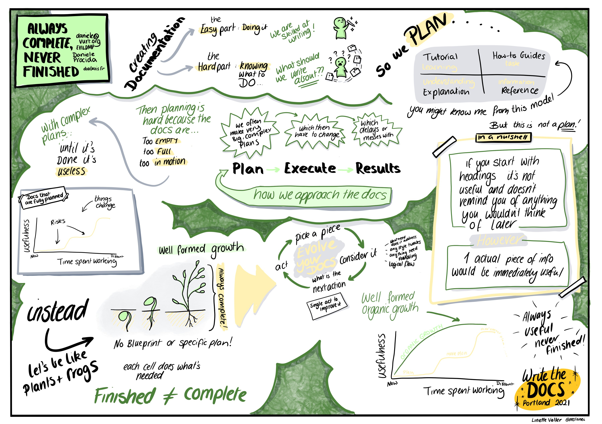

I recently attended a fantastic seminar on documentation and the [diataxis framework](https://diataxis.fr/) by Daniele Procida.  I found it really helpful in terms of thinking about how to categorise different types of documentation, and I'd recommend checking it out.  

A topic that was touched on was how to go about planning the documenting of software.  There was an absolutely fabulous drawn summary of this by Linette Voller, shown in the image below.

In essence, the idea is that documentation is hard to plan well. Picking something to work on or improving, and iterating, tends to result in the utility of documentation increasing faster over time than if you make in-depth plans.  Daniele used the metaphor of trying to get a child to tidy their room; if the child picks up their train set and then goes looking for the pieces of track and then the carriages, they'll spend a lot more time on the task than if they just pick up the nearest thing to them, put that away, and then iterate.  I am paraphrasing here, but Daniele highlighted the idea that sometimes plans are just a giant list of things that you've failed to do yet.

This really struck a chord with me.  I am a planner, a list writer, and, admittedly, a worrier. Still, I do believe that every success I've ever had in life has, in no small part, been due to me being able to be organised when I need to be.  I make a plan, and I execute it.  However, I am familiar with the feeling of being oppressed by my own unfinished lists.  The standard narrative on "getting shit done" is that planning is a crucial part, so it was refreshing to hear an alternative perspective. It made me want to reflect on my own approaches to setting goals and making plans.

One framework for goal setting that I have interacted with repeatedly is the concept of SMART goals - goals which are **S**pecific, **M**easurable, **A**ttainable, **R**elevant, and **T**ime-based.  I like this framework and have found it helpful in the past.  The one component I might quibble about is "attainable", as sometimes it's beneficial to set goals that exceed your expectations of what you can do. It can be difficult to judge what is possible if you're not entirely familiar with a domain.

Another way of looking at goal setting is thinking about things in terms of process goals versus outcome goals.  I used these concepts when I was working with a nutrition coach last year.  Outcome-based goals are things like "I would like to lose 5kg" or "I want to be able to run a 5K in under 35 minutes".  They help define where you want to get to but don't help you work out how to get there.  This is where process-based goals are helpful.  You might have an outcome-based goal of "I want to be able to run a 5K in under 35 minutes", supported by process goals such as "I will go for a 20-minute run every morning" and "I will look up a running coach to work with on my technique".  Even if the outcome-based goal feels distant and out-of-reach at present, having sensible process-based goals means you can still have that sense of achievement and productivity on the way towards it.  

This is even more important if that outcome-based goal isn't actually meaningful in itself.  Between October 2019 and July 2020, I lost 17.5kg in weight after improving my diet and doing more exercise.  This was more than I had initially intended when I set out, not believing I was likely to lose more than 8kg at the most.  If I'd aimed to lose that much in the first place, I'm not sure I would have succeeded; it would have felt like a huge number.  Instead, after reaching my original target weight loss, I focussed more on the process - planning my meals in advance, discussing my food choices with my coach, and exercising regularly.  The actual outcome wasn't too important - I just wanted to feel healthier and more confident. It didn't really matter whether that would be achieved after a 1kg weight loss or 20kg.  Here, an outcome-based SMART goal wouldn't have been all that useful.

I'm thinking as I'm writing, and I suppose the key thing here is knowing what you want to achieve and why.  If what you want to achieve is very specific, then having equally specific goals and subgoals is essential.  But, if what you want to achieve is a feeling or something much less tangible, I think it's OK, and perhaps even vital, to allow yourself to have vague goals.  They can - and maybe should - be supported by more specific subgoals and processes, but I think an important thing here is experimenting with different strategies and systems and regularly reviewing them to see if they are moving you towards your main goal.  Perhaps this is an issue of terminology - instead of treating the thing at the top of the hierarchy as a "goal", instead, call it an "aim".  Then, we can continue to have reasonably strict definitions of what makes a good goal but also recognise that each goal is simply a means to an end and not an end in itself.  This approach helps us retain a degree of flexibility in altering and updating goals and taking advantage of unexpected opportunities that may arise.

## Taking a minimalist approach to planning

One habit I picked up in the past year, due to the ongoing coronavirus situation, was never making too many plans in advance.  I like my calendar to be pretty full. Before this, I'd have planned holidays, visits to see friends in other parts of the country, and things like attending comedy shows, months in advance.  I loved having something to look forward to; the anticipation was sometimes almost as fun as the execution.  The global pandemic forced me to change my approach.  The uncertainty around the upcoming levels of restrictions, and disappointments as holidays were cancelled, led me to make far fewer plans more than a week in advance.  It's only as things are starting to reopen again in the UK that I'm realising how much I actually like this approach.  There's a lot more flexibility in my weekends, and I'm not having to groan at having to do something I'd committed to months ago but no longer actually want to do.

I think I am going to adopt a similar approach to goal setting.  Realistically, I think I can set goals to achieve over the next month, but longer than that, and there's too much uncertainty.

